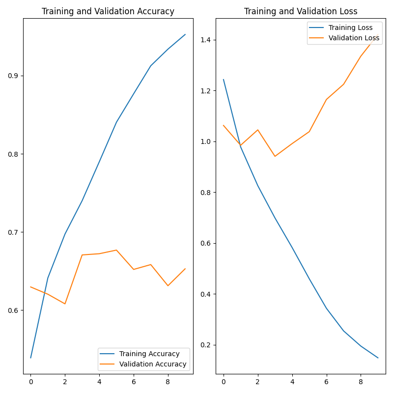
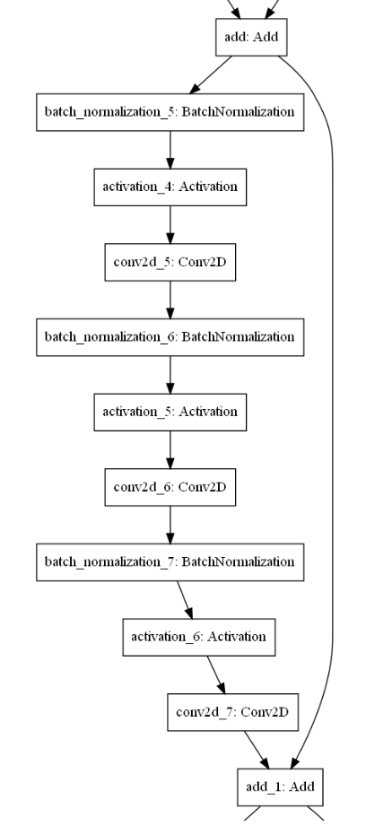
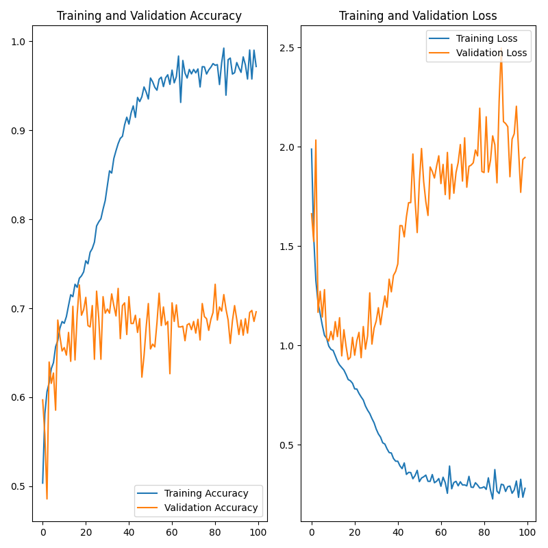
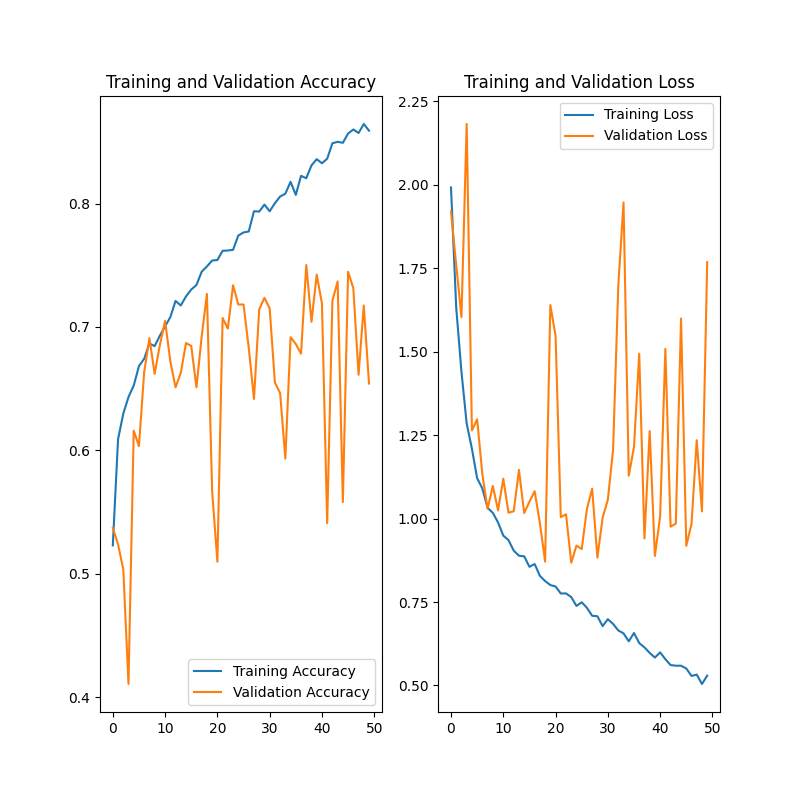
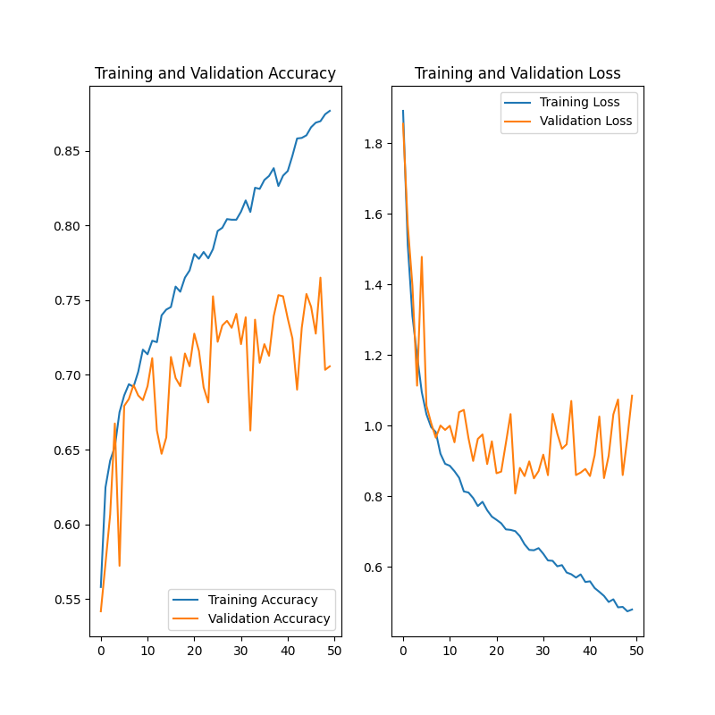

# Hacker earth competition
**Authors : Henri Bertrand & Mathieu Hannoun**

This project is the result of our trials on[Hacker earth competition](https://www.hackerearth.com/en-us/challenges/competitive/hackerearth-deep-learning-challenge-holidays/).

## 1. First approach - Simple model, light preprocessing

For our first approach the preprocessing will be kept to a minimum. It consist of a normalization of pixel value, changing their ranges from [0-255] to [0-1].

The model is sequential and follow this architecture :

```
_________________________________________________________________
Layer (type)                 Output Shape              Param #   
=================================================================
rescaling (Rescaling)        (None, 300, 80, 3)        0         
_________________________________________________________________
conv2d (Conv2D)              (None, 300, 80, 16)       448       
_________________________________________________________________
max_pooling2d (MaxPooling2D) (None, 150, 40, 16)       0         
_________________________________________________________________
conv2d_1 (Conv2D)            (None, 150, 40, 32)       4640      
_________________________________________________________________
max_pooling2d_1 (MaxPooling2 (None, 75, 20, 32)        0         
_________________________________________________________________
conv2d_2 (Conv2D)            (None, 75, 20, 64)        18496     
_________________________________________________________________
max_pooling2d_2 (MaxPooling2 (None, 37, 10, 64)        0         
_________________________________________________________________
flatten (Flatten)            (None, 23680)             0         
_________________________________________________________________
dense (Dense)                (None, 128)               3031168   
_________________________________________________________________
dense_1 (Dense)              (None, 6)                 774       
=================================================================
```

### Results



It is pretty obvious that even thought performance tends to increase for the training, the validation accuracy does not follow this is a sign of overfitting and lack of generalization.

## Resnet

Classical Resnet with this bloc architecture :



### Results



Even thought performances seem to be a little bit better, the problem of overfitting persist.

## Restnet with data augmentation

We used simple data augmentation with horizontal flip.



This seem to only make performances sway much more.

## Resnet with squeeze and excitation and data augmentation

We added squeeze and excitation bloc to our Restnet architecture, the basic building bloc is now :


### Results



This achieve better performances with less sway, less overfitting and at practically no additional computational cost.

